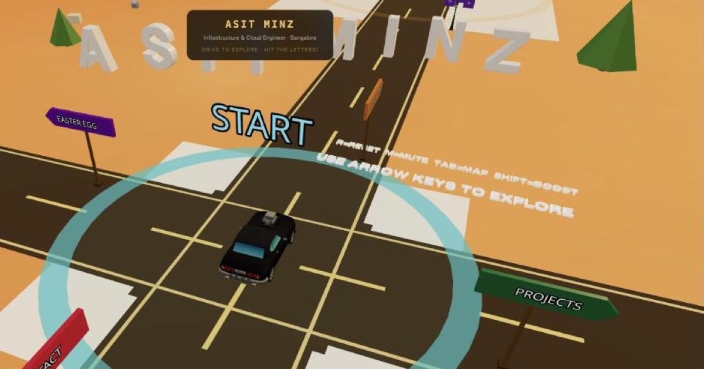
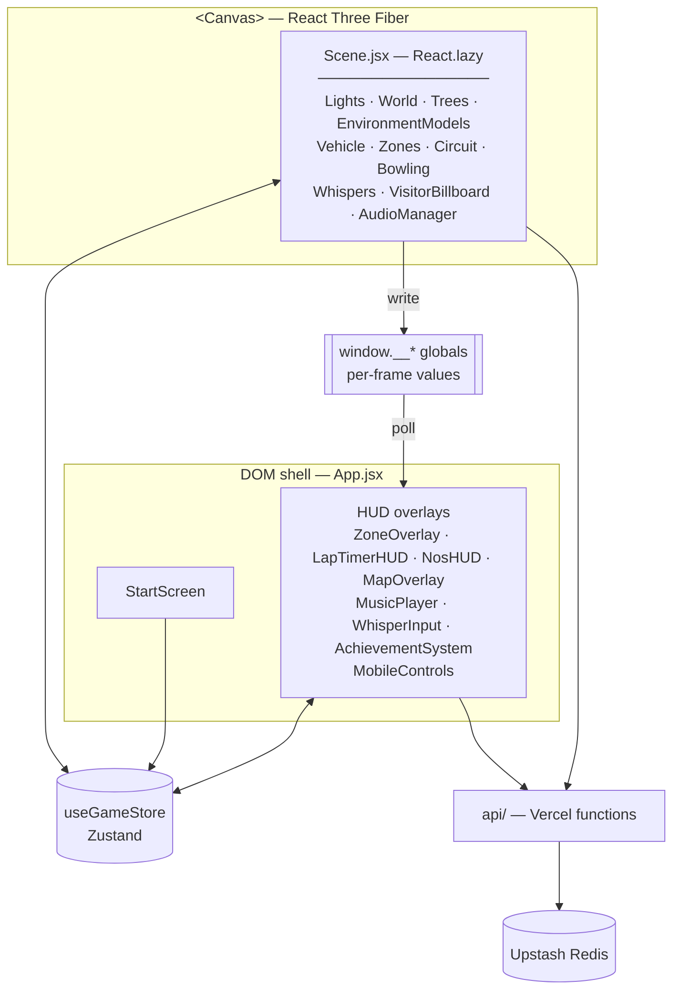
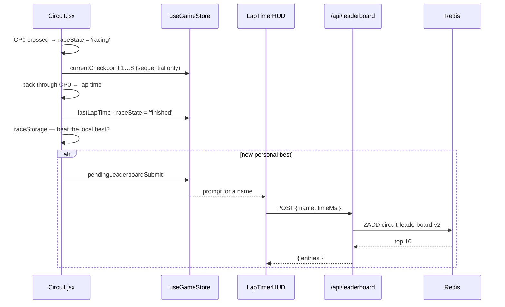

<div align="center">

# asit-portfolio

### A résumé you **drive through**.

An interactive 3D desert world where every landmark is a section of my CV — plus a racing circuit with a global leaderboard, a bowling alley, and messages left by visitors, pinned to the exact spot where they wrote them.

**[▶ Live site — asitminz.com](https://asitminz.com)**

[](https://react.dev)
[](https://vite.dev)
[](https://threejs.org)
[](https://rapier.rs)
[](https://zustand.docs.pmnd.rs)
[](https://vercel.com)
[](LICENSE)



</div>

---

## Contents

- [The idea](#the-idea)
- [Quick start](#quick-start)
- [Controls](#controls)
- [The world](#the-world)
- [Features](#features)
- [Architecture](#architecture)
- [API reference](#api-reference)
- [Client-side storage](#client-side-storage)
- [Project layout](#project-layout)
- [Performance](#performance)
- [Development](#development)
- [Deployment](#deployment)
- [Making it yours](#making-it-yours)
- [Troubleshooting](#troubleshooting)
- [Design system](#design-system)
- [Known limitations](#known-limitations)
- [Roadmap](#roadmap)
- [Credits & license](#credits--license)

---

## The idea

Built by **Asit Minz** — Cloud & Infrastructure Engineer, Bangalore.

A scrollable résumé asks for thirty seconds of politeness. A drivable one asks for five minutes of curiosity. So the CV lives inside a physics world: you get a car with real suspension, and the experience section is a place you have to *arrive at*. Nothing ever pauses the driving — panels fade in beside you while you keep moving, and if you'd rather ignore the résumé entirely and go set a lap record or knock down ten pins, that's a supported way to use the site.

**But a recruiter with four minutes is not the only visitor, so there are two front doors.** The boot screen offers **GG MODE** — the 3D world — and **OG MODE**, the same career as a written, scrollable portfolio: experience, projects, skills, contact, CV download. Neither is a consolation prize. OG MODE is also where the performance notice points anyone whose device can't render the world, and while it's open the canvas drops to `frameloop="demand"` — someone who came to the résumé *because* the 3D was too slow should not still be paying for the 3D.

Inspired by the [Bruno Simon folio](https://bruno-simon.com/) school of playable portfolios; the design system is derived from folio-2025's source and documented in [`DESIGN.md`](DESIGN.md).

**By the numbers:** ~11,400 lines of JS/JSX · 37 React components · 3 serverless routes · 48 GLB props · 7 music tracks · 9 race checkpoints · 8 achievements · 0 shadow maps · 0 world boundaries.

---

## Quick start

```bash
git clone https://github.com/Asit0007/asit-portfolio.git
cd asit-portfolio
npm install
npm run dev          # → http://localhost:5173
```

That's the whole setup. Requires **Node 20+** (Vite 6). No environment variables are needed to run the world — the leaderboard, comments and visitor counter simply show `OFFLINE` until Redis credentials exist (see [Development](#development)).

---

## Controls

### Desktop

| Input | Action |
|---|---|
| `W` `A` `S` `D` / arrow keys | Drive — throttle, steer, brake-then-reverse |
| `Space` | Brake |
| `Shift` | NOS boost (drains and recharges — watch the HUD gauge) |
| `R` | Reset the car (flipped, stuck, or lost) |
| `C` | Leave a comment in the world |
| `Tab` | Toggle the map |
| `M` | Toggle music |

### Mobile — a real cockpit

Portrait phones are flipped into landscape by the app itself (a CSS-rotated frame with an animated flip intro), so the world always gets the wide view it was composed for.

| Control | Where | Behaviour |
|---|---|---|
| **Steering wheel** | Bottom-left | Analog — rotate with your thumb, ±110° of lock maps to ±1.0 steer |
| **Gas / brake pedals** | Bottom-right | Two-pedal: brake stops the car first, then reverses |
| **Boost** | Above the gas pedal | Same NOS as `Shift` |
| **Map / music** | Top-right corner row | The bottom corners belong to the wheel and pedals |

Every keyboard affordance has a touch equivalent — mobile parity is a hard rule, not a nice-to-have.

> **Typing guard.** Both the global hotkey listener and the vehicle's input reader bail out when focus is in an `<input>`, `<textarea>` or `contentEditable` element. Without it, typing "record" into the leaderboard name box would reset your car, reopen the comment panel and yank the steering right, all mid-word. Any new hotkey must keep this guard.

---

## The world

A 320 × 320-unit desert bounded by invisible walls at ±160, with the résumé zones clustered at the centre and the attractions pushed out to the empty quadrants.

```
                                 −Z  (north)
      ╔═══════════════ RACING CIRCUIT — wraps everything ════════════════╗
      ║                                                                  ║
      ║                         CLOUD & INFRA                            ║
      ║                           (0, −55)                               ║
      ║                                                                  ║
−X ◀──╣   EASTER EGG              START                PROJECTS          ╠──▶ +X
      ║    (−55, 0)               (0, 0)                (55, 0)          ║
      ║                                                                  ║
      ║                            CONTACT                               ║
      ║                            (0, 55)                               ║
      ║                                                                  ║
      ║   BOWLING                                    START/FINISH        ║
      ║   (−90, 90)                                  (45, −109)          ║
      ╚══════════════════════════════════════════════════════════════════╝
                                 +Z  (south)
```

| Zone | Position | Colour | Contains |
|---|---|---|---|
| **START** | `0, 0` | `#00d4ff` | Name title, the car's spawn |
| **☁ Cloud & Infrastructure** | `0, −55` | `#f59e0b` | Microland role, Azure/AWS/Terraform, AZ-104 |
| **🛠 Projects** | `55, 0` | `#10b981` | CloudPulse, QuantBot, Magento DeployKit + billboard slideshow |
| **🥊 Easter Egg** | `−55, 0` | `#a855f7` | Muay Thai, gaming, badminton, certs in progress |
| **📬 Contact** | `0, 55` | `#f43f5e` | Email, LinkedIn, GitHub, phone, location |

Drive inside a zone's radius and its panel fades in. The résumé content itself lives in the `ZONES` object in [`src/store/useGameStore.js`](src/store/useGameStore.js) — one place, not scattered through components.

---

## Features

<table>
<tr><td width="50%" valign="top">

### 🏁 Racing circuit
A 9-checkpoint wraparound loop with a real asphalt ribbon, raised red/white kerbs, a dashed centreline, a checkered start/finish strip and an overhead gantry aligned to the track tangent. Its palette lives in `src/data/track.js`, so the jump ramps out in the desert are painted from the same asphalt and kerbs rather than from a copied hex string. Checkpoints must be hit **in order**, so cutting the course doesn't count. Lap times persist locally; a new personal best prompts you to submit to the **global top-10 leaderboard**.

</td><td width="50%" valign="top">

### 🎳 Bowling
Drive the car into a giant ball and plough it down a wooden lane into 10 towering pins. Dimensions are folio-2025's own `areas.glb` values scaled to this car — the pins deliberately dwarf you, which is the joke. A strike is detected per-frame from each pin's up-vector (all 10 tilted past ~60°), and an in-world **↻ RESTART** sign resets the rack by click or tap.

</td></tr>
<tr><td valign="top">

### 💬 Visitor comments
Press `C` and leave a 30-character message. It's pinned at your car's exact world position for everyone who visits afterwards, and the 30 newest stay live. One per browser. *(Internally these are still called "whispers" — see the note in [Architecture](#architecture).)*

</td><td valign="top">

### 🏆 Achievements
Eight one-time unlocks with a toast queue: each of the four résumé zones, **Full Explorer** for finding all four, **First Lap Completed**, **New Best Lap Time**, and **🎳 STRIKE!**. Persisted in localStorage — deliberately lightweight, a nudge toward the whole CV rather than a game layer.

</td></tr>
<tr><td valign="top">

### 🎵 Music & SFX
A shuffled 7-track playlist with a HUD player (`M` to toggle), plus speed-driven engine tone, brake squeal, collision thumps and a three-layer tyre-on-gravel bed — all synthesised, no SFX downloads. Tracks stream through `<audio>` rather than decoding as buffers, so pressing START never blocks the main thread. They're also **loudness-matched** — the source files spanned 10.6 LUFS and clipped on five of seven, so each track is attenuated to a common −16 LUFS target rather than re-encoded, which cleans up the clipping for free along the way.

</td><td valign="top">

### 📊 Live visitor counter
An in-world billboard reads a Redis counter, incremented once per browser. Like every network-backed feature, it degrades to a quiet `OFFLINE` label rather than an error if the backend isn't reachable.

</td></tr>
<tr><td valign="top">

### 🏜 The desert doesn't end
Drive past the old map edge and the sand simply keeps going — a 3×3 grid of dune tiles follows the car and rebuilds ahead of it. The height of the sand is a **pure function of world position**, so neighbouring tiles agree exactly along their shared edge and a tile rebuilt on the way back is identical to the one that was there before: no seams, no state, nothing to stream or download. The dunes are real terrain, not scenery — each tile carries a heightfield collider on the same samples as its mesh. Nothing out there exists until the car goes looking for it, so visitors who never reach the edge pay nothing for it. Past 450 units a dismissible panel offers a lift home.

The join back into the built world is a colour match, not a border. The ground plane's outer band ramps to exactly the tone the dunes start from — a *square* fade, because measuring across the join showed the mismatch was entirely at the **corners** (23 luma levels, where the plane's 4-corner gradient runs pale) while the edge midpoints already agreed to within 0.7. Everything you drive on sits inside 131 units and the ramp starts at 150, so the diorama still reads where it was meant to.

</td><td valign="top">

### 🛣 Instructions on the road
The controls are painted on the asphalt at the crossroads, where white-on-black reads instantly — they used to lie on the orange sand, which is close to the worst contrast this palette can produce. And they're **dynamic bodies**, one per word: the world's first lesson is "hit the letters", so it would be odd for the sentence teaching you to drive to be the one thing bolted down.

</td></tr>
<tr><td colspan="2" valign="top">

### 💥 Explosive crates
Eight wooden crates sit on the road shoulders. Hit one above walking pace and it detonates: a fireball, the hardest camera shake in the game, and **an impulse that throws the car** — measured at 8.9 u/s upward, a 2.7-unit apex and about a second of air, landing back on its wheels. They re-arm after seven seconds, so the toy isn't single-use.

The crate is built as boards and a frame rather than painted onto a cube, and merged into **one vertex-coloured geometry** — the mesh is instanced, so every crate in the world is still a single draw call for ~340 triangles uploaded once. It's carpentry rather than a texture for a reason: with no shadow maps a flat face reads as one block of colour whatever is printed on it, so what makes wood read as wood at speed is the *step* between a proud board and the shadowed groove beside it.

</td></tr>
<tr><td colspan="2" valign="top">

### 🗺 One road network, everywhere
A paved circus at the crossroads, four radials out to the résumé zones, and a **ring road** — radius picked *exactly* so it threads all four inner jump ramps, tangent to each one, rather than crossing them side-on. Every drivable feature (zones, ramps, the bowling approach, the circuit's start/finish) is reachable on tarmac now; off-road is still there as the shortcut, because cutting a corner is half the fun of having a car. `src/data/roads.js` is the one file that knows where the road is — the map, the renderer and the tree/rock scatter all ask it, so nothing spawns on the road and the map never disagrees with what you're driving on.

### 🆘 Stuck? There's a way out
Beached on a crate with the wheels spinning in the air, or just upside down — a dismissible prompt offers **STAND ME UP** (rights the car exactly where it is, keeping your progress) or **BACK TO START**. Two different tests decide it's actually stuck rather than just parked: tipped past ~70° needs no input at all, but a car sitting upright only counts as stuck if you're holding the throttle and going nowhere for 2.6 seconds straight — long enough that nosing a kerb never falsely triggers it.

</td></tr>
</table>

Plus: a **map overlay** (`Tab`) showing zones, the real circuit shape, the road network and your car; a **NOS gauge**; a **lap timer HUD**; an animated `document.title` that reacts to your speed; and a WebGL context-lost recovery overlay.

---

## Architecture

### Two render worlds, one store

`App.jsx` is the DOM shell. It mounts `<KeyboardControls>` → `<Canvas>` → `Scene.jsx` (everything 3D), and alongside the canvas the 2D HUD. The two halves never touch each other directly — they communicate through a Zustand store and, for per-frame values, a small set of `window.__*` globals.



**`Scene` is `React.lazy`-loaded on purpose.** It is the only import path to `@react-three/rapier`, so the ~2 MB physics chunk stays out of the initial bundle and streams in behind the start screen. Statically importing Scene — or anything that imports Rapier — from `App`/`main` silently collapses that split.

### State: one store, and deliberate globals

[`src/store/useGameStore.js`](src/store/useGameStore.js) is the single hub: zone state, `gameStarted`, mobile pedal booleans, the race state machine (`idle | racing | finished`), best/last lap, `pendingLeaderboardSubmit`, achievements, comments, and the vehicle's Rapier body handle.

Values that change **every frame** are deliberately *not* in Zustand — routing them through React would re-render the tree 60× a second:

| Global | Written by | Read by |
|---|---|---|
| `__carPosition` | `Whispers.jsx` | comment placement |
| `__nosLevel`, `__isBoosting` | `Vehicle.jsx` | `NosHUD`, animated `document.title` |
| `__raceElapsedMs` | `Circuit.jsx` | `LapTimerHUD` (50 ms poll) |
| `__mobileSteer` | `MobileControls.jsx` wheel | `Vehicle.getInput()` |
| `__resetCar` | `App.jsx` `R` handler | `Vehicle.jsx` frame loop |

### Vehicle physics

A Rapier **raycast vehicle controller** on a chassis rigid body: four wheels, front pair steered, rear pair driven (RWD), gravity at `[0, −20, 0]` — twice real, because toy-scale worlds feel floaty at 9.8.

The constants at the top of [`Vehicle.jsx`](src/components/Vehicle.jsx) are the entire tuning surface, and the comments there record the non-obvious calls: an anisotropic inertia override to kill wheelies and stoppies, a soft speed cap via force attenuation rather than a hard clamp, *moderate* (not maximal) tire grip because a raycast vehicle with full rotation freedom will trip over its own tires and roll, and a chassis collider kept deliberately above the wheels' contact patch.

The car faces **−Z**; the GLB is rotated `Math.PI` to match, and a `FORWARD_SIGN` constant exists to flip drive direction if the wheel setup ever changes. A procedural `BoxCar` renders while the GLB loads. The camera is a speed-zooming follow-cam in the same `useFrame`, with a brief decaying "establishing" bias when you enter a zone.

> **`CHASSIS_MASS` is not what the chassis weighs.** It reads `2`, but Rapier treats it as mass *added* to what it derives from the collider — `body.mass()` returns **5.67**. Anything applying an impulse to the car must scale by `body.mass()` at the time, not by the constant. The crate blast was tuned against the `2` first and landed at a third of its intended strength, which looked like a physics bug and was arithmetic. `ExplosiveCrates.jsx` therefore states its magnitudes as *velocity changes* and multiplies; a velocity is also a number you can picture, which an impulse is not.

> **The car's wheels are added geometry, not the model's.** `car-1.glb` is a single Draco mesh whose wheels are painted into the bodywork, so there was nothing in it to rotate. Four vertex-coloured alloys are laid over the painted ones — the outer group steers, the inner mesh rolls — taking steer angle and ride height from the vehicle controller, which already knew both. `VIS_LIFT` and `BODY_LIFT` move only what is *drawn*: never the collider, the axles or the suspension, so wheel size is free to change without touching how the car drives.

### Race → leaderboard flow

[`src/data/track.js`](src/data/track.js) is the single source of truth for circuit geometry. Its checkpoint coordinates were verified programmatically against every world hazard (all four zones, bowling, the boundary walls) with positive clearance margins — checkpoint 5 looks redundant on the map but is load-bearing for the curve shape, so don't delete it.



> **Versioning rule.** The Redis leaderboard key (`circuit-leaderboard-v2`) and the localStorage best-lap key (`circuitBestLapMsV2`) are bumped **together** whenever the track's shape or length changes — otherwise old times get compared against a different circuit.

### Rendering & performance tiers

[`usePerformance.js`](src/hooks/usePerformance.js) measures real frame times and picks a tier. Sampling is gated on `gameStarted` with a 1.5 s settle and a 20-frame warmup discard — measuring during load would pin a fast desktop to the lowest tier for the whole session on the strength of boot-time jank.

| | Tier 0 — mobile / weak GPU | Tier 1 — medium | Tier 2 — desktop |
|---|---|---|---|
| Trees | 20 | 50 | 100 |
| Props | 6 | 14 | 22 |
| Resolution | 1.2 MP budget (`1–2` dpr) | `1–1.5` dpr | `1–1.5` dpr |
| Fog distance | 260 | 150 | 300 |
| Antialiasing | on | on | on |
| Physics timestep | 1/60 | 1/60 | 1/60 |

Mobile user agents skip measurement and go straight to tier 0 — settled in the hook's *initial state*, not after mount, because the tier feeds fog and resolution and resolving it late made the world visibly change the moment you pressed START.

**Tier 0 budgets pixels, not device pixel ratio.** A fill-rate-bound scene pays for *shaded pixels*; dpr is only the multiplier, so a flat `dpr: 1` renders a 3× phone at a ninth of its screen resolution and lets the browser upscale the result — which is exactly what "pixelated" looks like, and was never a measurement of what the phone could afford. `resolveDpr()` divides a 1.2 MP budget by the viewport's area instead, so an iPhone 14 lands near 1.9 and an iPad near 1.1 at the same cost. It depends on viewport *area*, so `useRenderDpr` re-asks on resize and orientationchange — R3F's array form only ever clamps `window.devicePixelRatio`, which never changes on rotation.

**The watchdog never stops sampling, and only ever steps down.** Below tier 0 there is no simpler world, so what gives way there is **resolution** (`SCALE_STEPS`) before the "your device is struggling" notice — softening the picture beats deleting more of the world, and the floor of that ladder is still ~2× sharper than the old flat `dpr: 1`.

`antialias` is a WebGL context attribute, fixed at Canvas mount, so it can't be tier-driven — it is simply on everywhere. It used to be off on mobile, which had it backwards: mobile GPUs are tile-based deferred renderers and resolve MSAA in on-chip tile memory, making it far cheaper there than on a desktop immediate-mode GPU.

**`backdrop-filter` over a live canvas is a per-frame compositor readback, not a paint.** Four blurred HUD panels sit on screen the whole time you drive, so `App.jsx` adds a `.flat-hud` class (`isMobile && gameStarted`) that neutralises every one of them while the world is rendering; they already sit on 75–92% opaque grounds. The start screen keeps its blur — the canvas behind it is `frameloop="demand"` and isn't repainting.

> **There are no shadow maps.** Dynamic shadows were removed entirely — the depth-map pass cost far more than the visual payoff. `Lights.jsx` is a static warm sun plus fills, and depth comes from flat colour contrast and fog. Don't reintroduce `castShadow` / `receiveShadow` / `<Canvas shadows>` without revisiting that trade (see `DESIGN.md` §6).

**That trade has a cost, and the dunes are where it came due.** With no shadow maps, shape has to come from colour contrast — and the open desert had none to give: the sand is over-exposed, so a slope simply doesn't change the pixel. Measured on the framebuffer, a frame of open desert had a luminance standard deviation of **0.05 out of 255**, and pushing the terrain to six times its relief still only spread the frame by 14 levels. The range was never missing from the geometry; it was gone in the render. So the dunes are shaded the way the track and the ramps are — **the slope is baked into vertex colours** — and the frame now spans ~108–182 where it spanned 149–155. It looks like a redundant flat colour if you skim it; it is the only reason there is a landscape out there.

The canvas also runs `frameloop="demand"` until the game starts, so nothing simulates behind the start screen. (Rapier's own `paused` prop is *not* used for this — pausing at mount leaves the vehicle controller uninitialised and the car never moves again.)

### Audio — synthesised, not sampled

Everything except the music is generated in Web Audio: engine tone, brake squeal, collision thumps, explosions and the tyre-on-gravel bed. On a 15 MB payload budget, a sound effect you can compute is a sound effect you don't download.

Gravel is the one worth explaining, because it is three layers and the reason is not obvious. A lowpassed noise **body** carries the roar and a bandpassed **grit** bed reads the same buffer at an unrelated rate; on top of those, individual **stone** grains are scheduled through six fixed bandpass + pan lanes. The grains are the whole point — a looping buffer has colour but no *events*, so no gain or filter setting will ever make a bed alone read as stones rather than as wind.

Two things there are load-bearing and easy to undo by accident:

- **Each lane carries a makeup gain of `sqrt(nyquist / bandwidth)`.** A bandpass keeps only its own slice of a full-spectrum grain, so without it the stones land back underneath the bed they exist to cut through.
- **Grain envelopes decay to `amp * 0.02`, not to zero.** An exponential ramp's rate is set by its *ratio*, so running one down to 0.0001 packs 60 dB into the grain's length and turns every stone into a 5 ms click.

Keep the grain rate sparse (~14/s). Denser and they overlap into another wash, which is the thing the layer exists to avoid.

### Backend

Three Vercel serverless functions, all the same shape: `Redis.fromEnv()` constructed **lazily inside the handler**, a **503** when env vars are missing, and try/catch around everything. Their client counterparts in `src/utils/*Api.js` resolve to `null` on *any* failure, so the UI degrades to an `OFFLINE` label instead of throwing. Keep that contract.

> **Naming note.** The comments feature is called "whispers" everywhere in code — `Whispers.jsx`, `whisperApi.js`, `/api/whispers`, the Redis key, the localStorage key. Only the user-facing copy says "comment". The internals aren't renamed because the Redis and localStorage keys hold live production data.

---

## API reference

All routes live at the repo root under `api/` and deploy alongside the static build.

### `GET|POST /api/leaderboard`

Redis sorted set `circuit-leaderboard-v2` — keeps the fastest 100, returns the top 10.

```jsonc
// GET → 200
{ "entries": [ { "name": "ASIT", "timeMs": 48213 } ] }

// POST { "name": "ASIT", "timeMs": 48213 } → 200 (same shape as GET)
// name  — trimmed, max 12 chars, required
// timeMs — finite, > 0, ≤ 3_600_000
```

### `GET|POST /api/whispers`

Redis list `whispers` — capped at the 30 newest.

```jsonc
// GET → 200
{ "entries": [ { "id": "1723…-k3x9f2", "message": "nice drift", "x": 12.4, "z": -33.1 } ] }

// POST { "message": "nice drift", "x": 12.4, "z": -33.1 } → 200
// message — trimmed, max 30 chars, required
// x, z    — finite world coordinates, required
```

### `GET|POST /api/visitors`

Redis counter `total-visitors`. `POST` increments; the client dedupes to once per browser via localStorage.

```jsonc
// GET / POST → 200
{ "count": 1427 }
```

### Status codes

| Code | Meaning |
|---|---|
| `200` | OK |
| `400` | Validation failed (bad name, non-finite time/coords, empty message) |
| `405` | Method not allowed — `Allow` header lists `GET, POST` |
| `503` | Redis env vars missing — *this is the "not configured" case, not an outage* |
| `500` | Redis or handler error |

Validation is intentionally light-touch — a 12-character name cap and time bounds, not real anti-cheat. It's a portfolio leaderboard.

---

## Client-side storage

Everything is wrapped in try/catch, because `localStorage` throws outright in some private-browsing modes.

| Key | Purpose |
|---|---|
| `circuitBestLapMsV2` | Personal best lap (versioned with the track) |
| `visitedZones` | Which résumé zones you've reached |
| `achievedIds` | Unlocked achievements |
| `hasWhispered` | One comment per browser |
| `hasCountedVisit` | Visitor counter dedupe |

No cookies, no analytics, no third-party requests at runtime — the webfont is self-hosted precisely to avoid one.

---

## Project layout

```
asit-portfolio/
├── api/                          # Vercel serverless functions (deploy from repo root)
│   ├── leaderboard.js            #   sorted set · fastest 100 · top 10 returned
│   ├── whispers.js               #   list · 30 newest · 30-char messages
│   └── visitors.js               #   counter · INCR once per browser
├── public/
│   ├── models/                   # 48 GLB props — car, trees, rocks, street pieces
│   ├── sounds/                   # 7 shuffled music tracks (112 kb/s)
│   ├── images/                   # WebP billboard slides
│   ├── fonts/                    # self-hosted JetBrains Mono variable (31 KB)
│   └── og-image.jpg · favicon.svg · resume.pdf
├── src/
│   ├── App.jsx                   # DOM shell · hotkeys · forced landscape · Canvas
│   ├── Controls.js               # drei KeyboardControls keymap
│   ├── audio.js                  # Howler playlist + synthesised engine/brake/collision/gravel
│   ├── index.css                 # @font-face + --font-mono + resets (0.46 kB built)
│   ├── components/               # 36 components
│   │   ├── Scene.jsx             #   ⚡ lazy boundary — the only path to Rapier
│   │   ├── StartScreen.jsx       #   boot screen + the whole OG MODE written portfolio
│   │   ├── Vehicle.jsx           #   raycast vehicle + follow-cam + the added wheels
│   │   ├── Circuit.jsx           #   track meshes + race state machine
│   │   ├── EndlessDesert.jsx     #   dune tiles that follow the car past the map edge
│   │   ├── ReturnHome.jsx        #   the lift back, once you're a long way out
│   │   ├── RoadInstructions.jsx  #   controls painted on the asphalt, one body per word
│   │   ├── Bowling.jsx           #   ball, pins, strike detection, restart sign
│   │   ├── Whispers.jsx          #   in-canvas markers + out-of-canvas input
│   │   ├── World / Trees / EnvironmentModels / Lights / Sky / SignPosts / …
│   │   └── ZoneOverlay / MapOverlay / LapTimerHUD / NosHUD / MobileControls / …
│   ├── data/track.js             # ⭐ single source of truth for circuit geometry
│   ├── hooks/usePerformance.js   # FPS sampling + TIER_CONFIG
│   ├── store/useGameStore.js     # ⭐ Zustand hub — and the ZONES résumé content
│   └── utils/                    # *Api.js (network) · *Storage.js (localStorage)
├── index.html                    # meta, OG/Twitter cards, font preload
├── eslint.config.js              # flat config — see Lint policy below
├── CLAUDE.md                     # deep architecture reference for contributors/agents
├── DESIGN.md                     # design system — read before any visual work
├── vite.config.js                # manual chunks + COOP/COEP dev headers
└── vercel.json                   # COOP/COEP production headers
```

---

## Performance

A production build, measured (gzip in parentheses):

| Chunk | Size | When it loads |
|---|---|---|
| `three` | 688 KB (176 KB) | initial |
| `fiber` — R3F + drei | 347 KB (116 KB) | initial |
| `react` | 147 KB (47 KB) | initial |
| `index` — app code | 127 KB (37 KB) | initial |
| `index.css` | 0.46 KB (<1 KB) | initial |
| **Initial total** | **~1.31 MB (~378 KB)** | before the start screen paints |
| `rapier` | 2.08 MB (774 KB) | **lazy** — streams behind the start screen |
| `Scene` | 75 KB (25 KB) | lazy, with Rapier |

Static assets total ~15 MB, dominated by 12 MB of music that streams on demand.

<details>
<summary><b>How it got here — the optimisation pass</b></summary>

`public/` went from 31 MB to 15 MB and the site stopped rendering differently on every OS:

- **Audio (the big one).** Howler defaults to `html5: false`, which XHR'd each 3–4.5 MB track as an arraybuffer and ran `decodeAudioData` over it *on the main thread, at the moment the visitor clicked into the world*. Now streams via `<audio>`, and tracks were re-encoded from 256 to 112 kb/s (they play at 0.22 volume). **28 MB → 12.2 MB.**
- **Typography.** All 54 `fontFamily` declarations said generic `monospace` — Menlo on macOS, Consolas on Windows, Courier on iOS, Droid Sans Mono on Android, with spacing only ever tuned against the first. Now a self-hosted JetBrains Mono variable (400–800, Latin subset, **31 KB**) behind a `--font-mono` custom property, preloaded. Self-hosted rather than the Google CDN because that path is a chained, un-preloadable request.
- **Tailwind removed.** Zero utility classes were actually in use, but the v4 scanner was harvesting bare words out of inline style *values* (`flex` ×63, `fixed` ×21, `uppercase` ×18) and emitting utilities nothing referenced — and its preflight set a sans-serif root family that fought `index.css`. **CSS 11.25 kB → 0.46 kB.**
- **Images.** Billboard textures were ~3K-wide PNGs. Resized to 1024 px and converted to WebP: **952 KB → 84 KB.**
- **Chunking.** `manualChunks` moved from object to function form — the object form let Rollup hoist React into whichever chunk imported it and emit a **0-byte** `react` chunk, so the split the config asked for never happened. Order matters too: the Rapier test must run before the `@react-three` one, or `@react-three/rapier` lands in the fiber chunk and drags the WASM wrapper out of its lazy boundary.
- **Link previews.** `index.html` had no description and a favicon pointing at a file that didn't exist. Now: description, canonical, theme-color, full Open Graph + Twitter card, and a 1200×630 hero.

</details>

---

## Development

### Prerequisites

- **Node 20+** (Vite 6, `build.target: 'esnext'`)
- A browser with WebGL 2 and `SharedArrayBuffer` support

### Scripts

| Command | What it does |
|---|---|
| `npm run dev` | Vite dev server at `localhost:5173`, with COOP/COEP headers |
| `npm run build` | Production build → `dist/` |
| `npm run preview` | Serve the production build locally |
| `npm run lint` | ESLint over `src/` and `api/` (flat config) |

### Running the API routes locally

Local dev has no Redis credentials, so the leaderboard, comments and visitor counter return `null` and the UI shows its offline states — **that's expected, not a bug.** To exercise the real routes:

```bash
npx vercel login
npx vercel env pull      # writes .env.local
npx vercel dev           # serves the Vite app *and* the api/ functions
```

The Vercel CLI ships as a project dependency, so `npx` resolves it without a global install.

### Lint policy

`npm run lint` must stay at **0 errors**. Two deliberate exceptions in the config:

- `catch (_) {}` and empty catch blocks are **allowed** — they're this codebase's graceful-degradation contract (network calls resolving to `null`, `localStorage` throwing in private browsing), not oversights.
- The react-hooks compiler rules (`set-state-in-effect`, `immutability`, `refs`) and `react-refresh/only-export-components` are demoted to warnings; they flag long-standing working patterns, notably the `Whispers.jsx` / `DevStats.jsx` split where one file exports both an in-canvas and an out-of-canvas component.

There are no tests. Verification for changes of any size is: a clean build, a lint run, and actually driving the car.

### Contributor reading order

1. **[`DESIGN.md`](DESIGN.md)** — before *any* visual, UI, motion or audio work. Tokens, scales, and the non-negotiable UX rules.
2. **[`CLAUDE.md`](CLAUDE.md)** — the deep architecture reference: invariants, why things are the way they are, and the traps.
3. This README for the map of the territory.

---

## Deployment

Deployed on **Vercel from the repo root**, so the `api/` functions ship alongside the Vite static build. Deploying `dist/` alone gives you a working world with permanently offline social features.

### Required headers

Rapier's WASM threading needs cross-origin isolation:

```
Cross-Origin-Opener-Policy: same-origin
Cross-Origin-Embedder-Policy: require-corp
```

Set in `vite.config.js` for dev and `vercel.json` for production. On any other host, set them at the CDN level — without them, physics won't initialise.

### Environment variables

Set on the Vercel project (either naming scheme works — `Redis.fromEnv()` checks both, covering whichever the Vercel/Upstash integration injects):

| Variable | Alternative |
|---|---|
| `UPSTASH_REDIS_REST_URL` | `KV_REST_API_URL` |
| `UPSTASH_REDIS_REST_TOKEN` | `KV_REST_API_TOKEN` |

Without them every function returns 503 and the UI shows `OFFLINE` — by design, never a crash.

---

## Making it yours

| To change… | Edit |
|---|---|
| **Résumé content** | The `ZONES` object in `src/store/useGameStore.js` — not the components |
| Zone positions, radii, colours | `ZONE_DEFS` in `src/components/Zones.jsx` |
| Car handling — power, grip, suspension | The constants block at the top of `src/components/Vehicle.jsx` |
| Track shape | `src/data/track.js` — then **bump both version keys** (Redis + localStorage) |
| Quality presets | `TIER_CONFIG` in `src/hooks/usePerformance.js` |
| Music | Drop MP3s in `public/sounds/` and list them in `PLAYLIST` in `src/audio.js` |
| Colours, type, motion | `DESIGN.md` first, then `src/index.css` and the component styles |
| Link previews | The OG/Twitter meta block in `index.html` |

---

## Troubleshooting

| Symptom | Cause & fix |
|---|---|
| Car won't move; world renders fine | Rapier didn't initialise — check the COOP/COEP headers are actually on the response |
| `/api/leaderboard` returns **404** in production | The deployment didn't include the functions — deployed from `dist/` instead of the repo root, or a stale deploy predating `api/` |
| `/api/…` returns **503 "not configured"** | Redis env vars missing from the Vercel project |
| Leaderboard/comments show `OFFLINE` locally | Expected — no Redis credentials in local dev. Use `vercel dev` |
| Typing in a text box drives the car | The typing guard regressed — check `App.jsx`'s keydown handler and `Vehicle.getInput()` |
| Mobile renders a thin strip of the world | The Canvas lost `resize={{ offsetSize: true }}` — R3F is measuring the portrait bounding rect instead of the rotated layout size |
| Mobile looks blocky / stair-stepped | The canvas is rendering below the screen's density. Check `resolveDpr()` is being used and that `useRenderDpr` is re-running on resize — a flat `dpr` array can't express the pixel budget |
| Mobile stutters with the HUD on screen | A `backdrop-filter` escaped the `.flat-hud` gate — blurring a live canvas costs a compositor readback every frame |
| An impulse on the car does almost nothing | It was scaled by `CHASSIS_MASS` (2) instead of `body.mass()` (5.67) — see Vehicle physics |
| A physics change silently does nothing at all | An exception inside a Rapier collision callback is swallowed with no console error. Run `npm run lint` — `no-undef` catches the common case — then log through the handler top to bottom |
| The camera flies across the map after R | A new teleport path moved the body without setting `camSnap` in `Vehicle.jsx` — the smoothing can't tell a teleport from driving fast |
| The car floats a few cm above a ramp | A ramp collider was built from the merged *visual* geometry; the hull must come from the bare deck, without the kerb/lip paint that sits on top of it |
| The open desert looks like a flat plane | The dune vertex colours were dropped for a flat `color`. The sand is over-exposed, so lighting alone can't show a slope — see the note in `EndlessDesert.jsx`. Raising `DUNE_HEIGHT` will not fix it |
| The instructions on the road run off the screen | A layout constant in `RoadInstructions.jsx` grew. Both lines have to finish before x ≈ 15.4 to fit the arrival frame — check it with a screenshot, not with the arithmetic |
| Words on the road are flung across the map on load | `CHAR_W` or `GAP` went too narrow, the word colliders overlapped, and the solver pushed them apart — widen, don't tighten |
| Initial bundle suddenly ~2 MB heavier | Something imported `Scene` (or Rapier) statically and collapsed the lazy split — check `manualChunks` order too |
| Blank screen after a GPU hiccup | WebGL context lost; the overlay in `App.jsx` should appear — reload to recover |

---

## Design system

`DESIGN.md` is extracted from the actual source of [folio-2025](https://github.com/brunosimon/folio-2025) and is the reference for every visual decision here. The short version:

- **Playful, warm, toy-like.** A low-poly diorama with flat stylised colours — never photoreal PBR.
- **Palette:** deep warm ground (`#0d0500`), amber emphasis (`#f0c060` / `#f59e0b`), one accent per panel. `#00d4ff` is reserved exclusively for speed-related UI.
- **HUD recipe:** translucent dark panel + `backdrop-filter: blur(10–14px)` + a 1px emphasis-colour border at ~18–35% alpha + 10–12px radius.
- **Everything physical first.** If the visitor can drive into it, bump it, or roll it, that beats a button. 2D UI exists only for reading and typing.
- **Never interrupt the driving.** No modals that steal control, no pause on zone entry.
- **Touch targets ≥ 44px**, and mobile gets full parity with desktop.

---

## Known limitations

- **Leaderboard anti-cheat is intentionally minimal** — a name cap and time bounds. Someone determined can POST a fake time.
- **One comment per browser** is enforced client-side via localStorage only.
- **No tests.** Verification is build + lint + drive.
- **Tier 0's 1.2 MP budget is calibrated, not proven on low-end hardware.** It was verified under real iPhone device metrics (DPR 3, forced-landscape) and the resolution ladder was exercised under CPU throttling, but no genuinely old Android has been measured. `pixelBudget` in `usePerformance.js` is the one knob if a weak device still struggles — the ladder will catch it either way, just later.
- **The 12 MB audio library** is the remaining payload weight; it streams rather than blocking, but a slow connection will notice.
- `asit-portfolio.vercel.app` belongs to **a different Asit** — the production URL is [asitminz.com](https://asitminz.com). Don't test against that domain.

---

## Roadmap

Real open items, not aspirational ones — things genuinely in progress or deliberately deferred:

- **The seven music tracks have unknown provenance.** They carry no ID3 tags and no download record even in the pre-optimisation git history, so nothing here can currently prove where they came from. `chromaprint`/`ffmpeg` are installed and a fingerprint-based identification workflow exists (see the `Cpaudio` skill), but running it against AcoustID needs a free API key that hasn't been supplied yet. Until it's identified or replaced, treat the current set as **unverified for redistribution**.
- **Tier 0's pixel budget is calibrated against real iPhone hardware only** — no old/low-end Android has been measured yet (see Known limitations above). The resolution ladder should catch a struggling device either way, just later than ideal.
- **Crate blasts only move the car.** A crate detonating near a name letter or a scatter prop doesn't disturb them, which reads a little oddly now that the car itself flies so visibly. Sweeping nearby dynamic bodies into the blast radius is a small, deferred addition.
- **The wooden crates are deliberately un-marked** — no hazard stencil, at the owner's call, even though the old bright-orange colour used to say "don't touch this" at a glance and quiet timber doesn't. Revisit if it turns out visitors are hitting them by accident rather than on purpose.

---

## Credits & license

- Design language and several world mechanics derive from **[Bruno Simon's folio-2025](https://github.com/brunosimon/folio-2025)** (MIT-licensed code). The *system* is borrowed — tokens, scales, rules — never their identity or assets.
- **JetBrains Mono** — SIL Open Font License 1.1 ([`public/fonts/OFL.txt`](public/fonts/OFL.txt)).
- Physics by **[Rapier](https://rapier.rs)**, rendering by **[Three.js](https://threejs.org)** through **[React Three Fiber](https://r3f.docs.pmnd.rs)** and **[drei](https://drei.docs.pmnd.rs)**.

Code is [MIT licensed](LICENSE). The résumé content and personal branding are not.

<div align="center">

**Asit Minz** · Cloud & Infrastructure Engineer · Bangalore<br>
[asitminz.com](https://asitminz.com) · [GitHub](https://github.com/Asit0007) · [LinkedIn](https://linkedin.com/in/asitminz)

</div>
